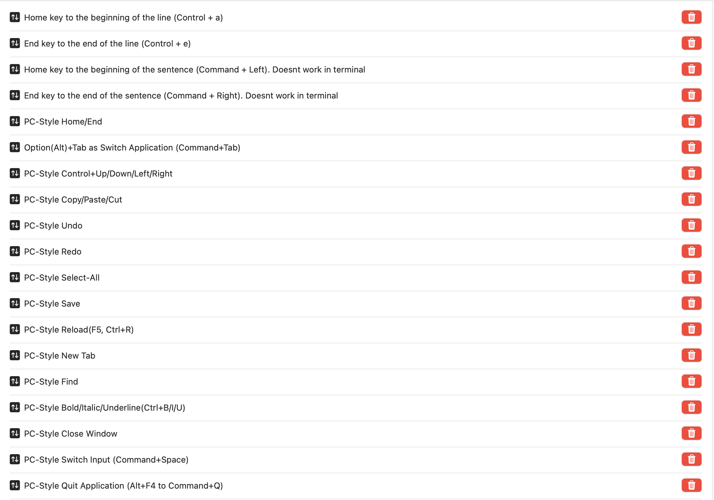
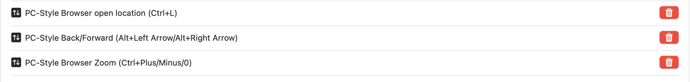

# "PC-style" keyboard shortcuts

* Install karabiner by visiting [here](https://karabiner-elements.pqrs.org) and downloading the .dmg file.

* Enable karabiner services, please note that karabiner is [open source](https://github.com/pqrs-org/Karabiner-Elements)

* Import and enable [PC Style keyboard shortcuts](https://ke-complex-modifications.pqrs.org/#pc_shortcuts)

* Set the following rules




* Import and enable [Open new terminal with Ctrl + Alt + t](https://ke-complex-modifications.pqrs.org/#open_terminal_window)


# Shift + Alt

* Use layout switcher from [here](https://github.com/3t0n/LayoutSwitcher)


# Long press key repeat

* Go to terminal and run this command.
```
defaults write -g ApplePressAndHoldEnabled -bool true
```

than restart.

# Open new terminal
* Copy [this](../resources/MacScripts/open_iTerm.workflow/) file. to
~/Library/Services/

* go to app shortcuts.

.png)
