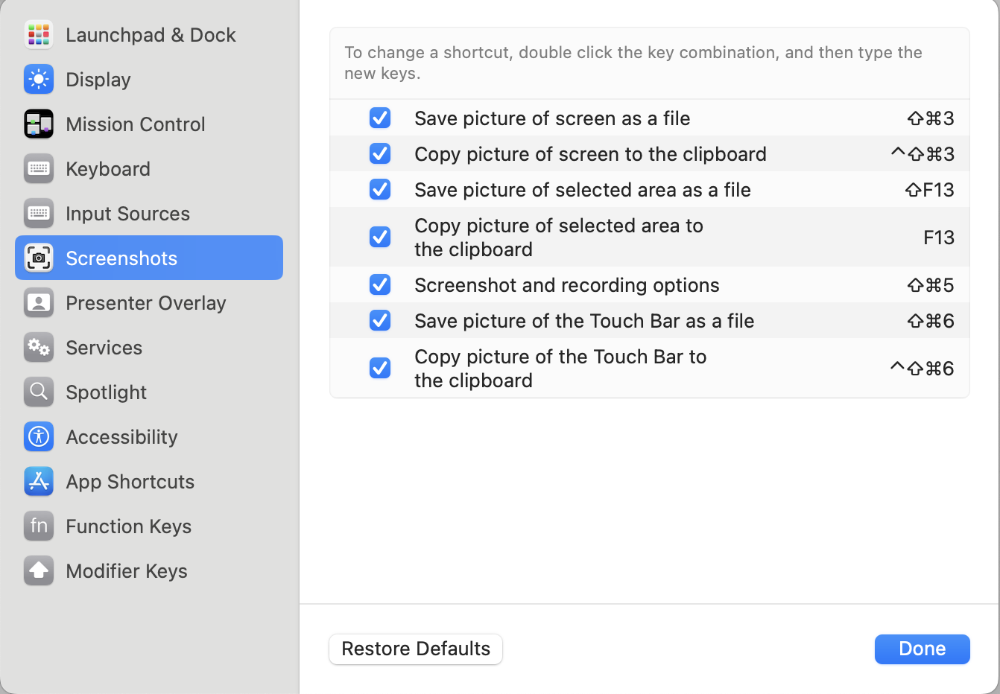

# "Print screen" to screenshoot

* Open settings, press the keyboard column.

.png)

* Press keyboard shortcuts.

.png)

* Press the "Screenshoot" column.

.png)

* Press the action you want to take and press the shortcut on the keyboard.

